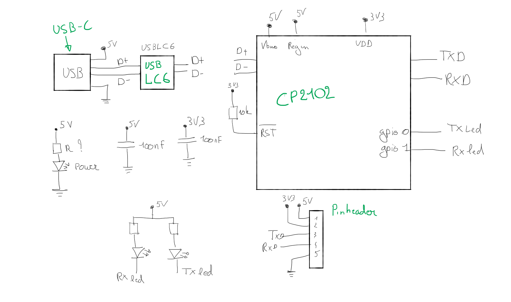

# USB-UART dongle

---

Name: <!-- TODO: place nam here -->

---

An USB to UART/Serial dongle. This is handy to communicate or program your microcontroller or sensor projects. The dongle provides status leds that show RX and TX activity. It also has a power led and an internal 3V3 power converter.

Features:

- [ ] All components should be SMD, except for pinheaders and connectors
  - [ ] Use 0805 for resistors and capacitors ([Wikipedia](https://en.wikipedia.org/wiki/Surface-mount_technology#Packages))
  - [ ] Pinheaders are male 2.54 mm (0.1 inch) pitched ([Wikipedia](https://en.wikipedia.org/wiki/Pin_header))
- [ ] The USB connector is of the USB-C type. Many variations exist. Choose the one with the `HRO_TYPE-C-31-M-12` footprint. This connector type has less pins and is hand solderable.
- [ ] To protect the USB devices against ESD, a protection circuit is recommended. The `USBLC6-2SC6` is a cheap and good solution.
- [ ] The resistor values for the leds need te be calculated depending on the leds you choose (eg: 20mA, 5mA, ...)

## Schematic

 <!-- TODO: Remove draft image when done -->

<!-- TODO: place image here -->

## PCB

| Front | Back |
|---|---|
| <!-- TODO: place image here (3D view) --> | <!-- TODO: place image here (3D view) --> |

## BOM

The BOM or Bill of Materials consists out of a list of all the components with some of their properties.

| Designator | Quantity | Description | Footprint | Farnell ordercode | Price |
|---|---|---|---|---|---|
| C1, C4 | 2 | 100nF | 0805 | [123456](https://be.farnell.com/raspberry-pi/rpi4-modbp-4gb/raspberry-pi-4-model-b-4gb/dp/3051887?ICID=I-HP-PP-RASPBERRY-PI-SEP_20-WF2293904) | 0.0012 € | <!-- TODO: remove this example -->
|||||||
|||||||

Total price: <!-- TODO: calculate total price -->
